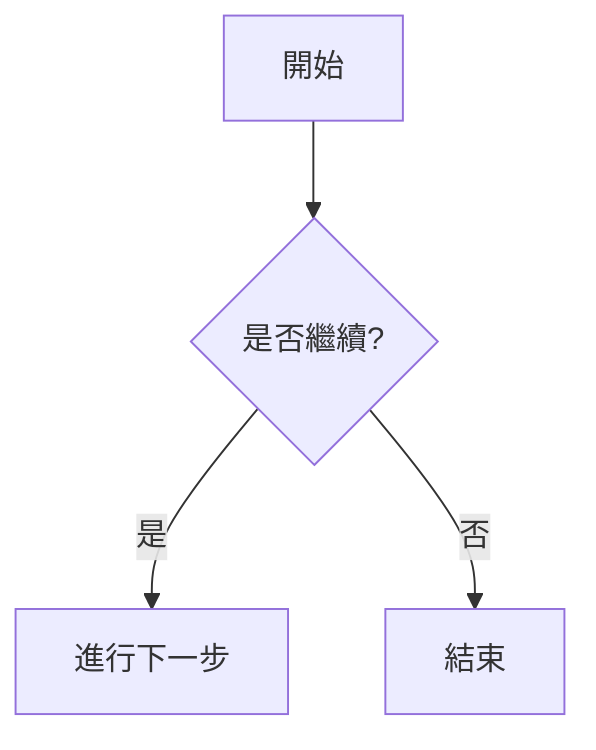
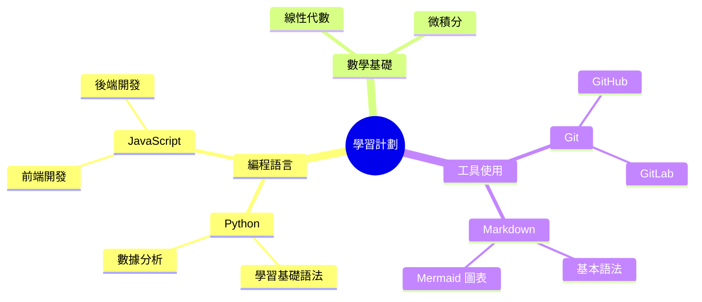

## 📌 目錄
- [1. 使用 Mermaid 畫圖](#1-使用-mermaid-畫圖)
- [2. 高效 Markdown 技巧](#2-高效-markdown-技巧)
- [3. 進階功能](#3-進階功能)
- [4. 小結](#4-小結)

---

## 1. 使用 Mermaid 畫圖

Mermaid 支持多種類型的圖表。以下是幾個例子：

### 流程圖


### 思維導圖


---

## 2. 高效 Markdown 技巧

### 任務清單
- [x] 完成 GitHub Pages 設置
- [x] 添加 Mermaid 支持
- [ ] 完善筆記內容

### 使用HTML
<p style="color: red; font-size: 20px;">這是一个使用 HTML 標籤的文本。</p>
<div style="background-color: #f4f4f4; padding: 10px;">
  <h3>自定义样式的块级内容</h3>
  <p>你可以使用内联样式来控制背景颜色和其他样式。</p>
</div>


### 表格
| 項目        | 描述           | 狀態    |
|-------------|----------------|---------|
| GitHub Pages| 網頁托管工具   | ✅ 完成 |
| Mermaid     | 繪圖語法工具   | ✅ 完成 |
| Markdown    | 文本標記語法   | 🔄 進行中 |

### 折疊內容
<details>
  <summary>點擊展開詳細說明</summary>
  這裡是折疊內容的示例。
</details>

### 代碼片段
```python
def hello_world():
    print("Hello, World!")
```

---

## 3. 進階功能

### 使用 Emoji 增加趣味性
- 🚀 快速啟動
- 📌 重點標記
- ✅ 事項完成

### 添加自定義樣式
```html
<span style="color:red;">這是紅色文本</span>
<span style="color:blue;">這是藍色文本</span>
```

### 插入圖片


### 插入視頻
```html
<video controls width="500">
  <source src="example.mp4" type="video/mp4">
</video>
```

---

## 4. 小結

使用 Markdown 和 Mermaid，你可以輕鬆創建專業且美觀的筆記。結合 GitHub Pages，這些內容可以方便地分享給他人。嘗試以上技巧，讓你的筆記更上一層樓！

---

### 示例徽章


